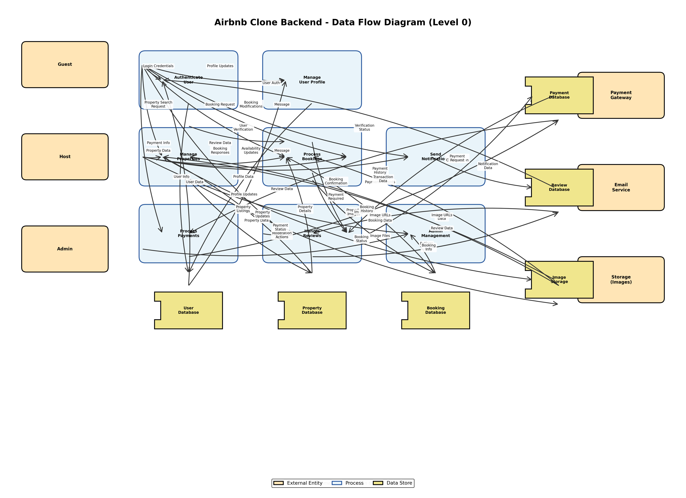

# Data Flow Diagram (DFD) - Airbnb Clone Backend

This directory contains the Data Flow Diagram for the Airbnb Clone backend system, illustrating how data moves through the system.

## Diagram

## Overview

This Data Flow Diagram (Level 0 - Context Diagram) shows the high-level data flows between:

### External Entities
- **Guest** - Users who book properties
- **Host** - Users who list properties
- **Admin** - Platform administrators
- **Payment Gateway** - External payment processing service
- **Email Service** - External email notification service
- **Storage (Images)** - External image storage service

### Core Processes
1. **Authenticate User** - Handles user login, registration, and authentication
2. **Manage User Profile** - Manages user profile information and updates
3. **Manage Properties** - Handles property creation, updates, and listings
4. **Process Bookings** - Manages booking requests, confirmations, and modifications
5. **Process Payments** - Handles payment transactions and refunds
6. **Handle Reviews** - Manages review submission and display
7. **Send Notifications** - Sends notifications via email and in-app
8. **Admin Management** - Platform moderation and administrative actions

### Data Stores
- **User Database** - Stores user accounts and profile information
- **Property Database** - Stores property listings and details
- **Booking Database** - Stores booking records and status
- **Payment Database** - Stores payment and transaction records
- **Review Database** - Stores reviews and ratings
- **Image Storage** - Stores property images and media files

## Key Data Flows

### Guest Flows
- Login credentials → Authentication → User Database
- Booking requests → Process Bookings → Booking Database
- Payment information → Process Payments → Payment Gateway
- Review data → Handle Reviews → Review Database

### Host Flows
- Property data → Manage Properties → Property Database
- Booking responses → Process Bookings → Booking Database
- Availability updates → Manage Properties → Property Database

### Admin Flows
- Moderation actions → Admin Management → Various Databases

### External System Flows
- Payment Gateway ↔ Process Payments ↔ Payment Database
- Email Service ↔ Send Notifications
- Image Storage ↔ Manage Properties ↔ Image Storage

## Diagram Notation

- **External Entities** (Peach rectangles) - External actors or systems
- **Processes** (Light blue rounded rectangles) - System processes that transform data
- **Data Stores** (Yellow rectangles with open side) - Data repositories
- **Data Flows** (Arrows with labels) - Movement of data through the system

## Purpose

This DFD helps visualize:
- How data enters the system
- How data is processed and transformed
- Where data is stored
- How data flows between components
- System boundaries and external interfaces

## Source

Generated programmatically using Python/Matplotlib: `generate_dfd.py`

## Related Documentation

- Features & Functionalities: `../features-and-functionalities/`
- Use Case Diagram: `../use-case-diagram/`
- User Stories: `../user-stories/`

---

**Last Updated**: October 29, 2024
**Version**: 1.0

