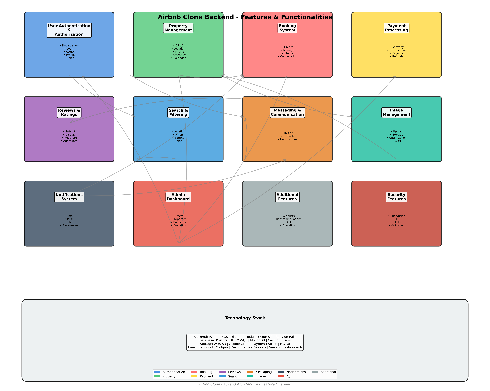

# Airbnb Clone Backend - Features and Functionalities Documentation

## Overview
This document outlines all the key features and functionalities that the Airbnb Clone backend needs to support. These features are essential for creating a complete vacation rental platform similar to Airbnb.

---

## 1. User Authentication & Authorization

### 1.1 User Registration
- **Email-based registration**: Users can sign up using email and password
- **Third-party authentication**: Integration with OAuth providers
  - Google Sign-In
  - Facebook Login
  - GitHub Authentication (optional)
- **Email verification**: Send verification emails to confirm user accounts
- **Password strength validation**: Enforce strong password requirements
- **Profile creation**: Create initial user profile upon registration

### 1.2 User Login
- **Email/Password login**: Secure authentication using credentials
- **OAuth login**: Single Sign-On (SSO) using third-party providers
- **Session management**: Handle user sessions securely
- **Remember me**: Optional persistent login sessions
- **Multi-factor authentication (MFA)**: Optional 2FA for enhanced security

### 1.3 User Profile Management
- **Profile CRUD operations**: Create, Read, Update, Delete user profiles
- **Profile information**: Store and manage:
  - Personal details (name, bio, profile picture)
  - Contact information
  - Identity verification status
  - Government ID upload and verification
  - Phone number verification
- **Privacy settings**: Control visibility of profile information

### 1.4 Password Management
- **Password reset**: Forgot password functionality via email
- **Password change**: Allow users to change passwords when authenticated
- **Password history**: Prevent reuse of recent passwords

### 1.5 Authorization & Role-Based Access Control
- **User roles**: 
  - Guest (booking properties)
  - Host (listing properties)
  - Admin (platform management)
  - Super Admin (full system access)
- **Permission system**: Control access to resources based on roles
- **API authentication**: JWT tokens or session-based authentication

---

## 2. Property Management

### 2.1 Property Listing (CRUD Operations)
- **Create listing**: Hosts can create new property listings
- **Read listing**: View property details, search and browse listings
- **Update listing**: Hosts can modify their property information
- **Delete listing**: Hosts can remove their listings (with booking constraints)

### 2.2 Property Information
- **Basic details**:
  - Title and description
  - Property type (apartment, house, villa, etc.)
  - Number of bedrooms, bathrooms, beds
  - Maximum guest capacity
  - Square footage/area
  - Floor level

- **Location data**:
  - Address (street, city, state, country)
  - Geographic coordinates (latitude, longitude)
  - Postal/ZIP code
  - Neighborhood information
  - Landmarks nearby

- **Pricing**:
  - Base nightly rate
  - Weekly discounts
  - Monthly discounts
  - Cleaning fees
  - Service fees
  - Security deposit
  - Additional guest fees
  - Seasonal pricing

### 2.3 Amenities & Features
- **Basic amenities**: WiFi, heating, air conditioning, kitchen, etc.
- **Safety features**: Smoke detector, carbon monoxide detector, first aid kit
- **Accessibility features**: Wheelchair accessible, step-free access
- **Entertainment**: TV, sound system, gaming console
- **Outdoor spaces**: Garden, balcony, pool, parking
- **Custom amenities**: Allow hosts to add custom amenity options

### 2.4 Property Images
- **Image upload**: Multiple image uploads per property
- **Image management**: 
  - Set primary/cover image
  - Reorder images
  - Delete images
  - Image compression and optimization
- **Image validation**: Verify image format, size, and content
- **Image storage**: Secure cloud storage integration (AWS S3, Cloudinary)

### 2.5 Property Availability Calendar
- **Availability management**: Hosts set property availability dates
- **Block dates**: Mark specific dates as unavailable
- **Booking constraints**: 
  - Minimum stay (nights)
  - Maximum stay (nights)
  - Same-day booking restrictions
  - Advance booking requirements
- **Calendar sync**: Sync with external calendars (optional)

### 2.6 Property Rules & Policies
- **House rules**: Smoking policy, pet policy, parties, etc.
- **Check-in/Check-out**: 
  - Check-in time window
  - Check-out time requirements
  - Flexible check-in options
- **Cancellation policy**: Set cancellation rules (strict, moderate, flexible)

---

## 3. Booking System

### 3.1 Booking Creation
- **Reservation process**: 
  - Search and select available dates
  - Select number of guests
  - Review pricing breakdown
  - Apply promotional codes (if available)
  - Submit booking request
- **Booking validation**: 
  - Check availability
  - Verify guest count against capacity
  - Validate dates against constraints
  - Calculate total cost

### 3.2 Booking Management
- **Booking status**: 
  - Pending (awaiting payment)
  - Confirmed
  - Cancelled
  - Completed
  - Refunded
- **Booking information**:
  - Booking ID/reference number
  - Property details
  - Guest information
  - Check-in/check-out dates
  - Total amount
  - Payment status

### 3.3 Host Booking Control
- **Accept/Reject bookings**: Hosts can approve or decline booking requests
- **Auto-approval**: Option for instant booking without host approval
- **Booking modifications**: Hosts can modify existing bookings (with constraints)

### 3.4 Guest Booking Management
- **View bookings**: List all guest bookings (upcoming, past, cancelled)
- **Booking details**: View comprehensive booking information
- **Booking modifications**: Request changes to existing bookings
- **Booking cancellation**: Cancel bookings according to policy

### 3.5 Booking Notifications
- **Email notifications**: 
  - Booking confirmation
  - Booking reminders
  - Check-in instructions
  - Booking cancellation
- **In-app notifications**: Real-time updates for booking status changes

---

## 4. Payment Processing

### 4.1 Payment Gateway Integration
- **Payment providers**: Integrate with payment processors
  - Stripe (primary)
  - PayPal (alternative)
  - Bank transfers (for specific regions)
- **Secure payment handling**: PCI-compliant payment processing
- **Multi-currency support**: Handle different currencies and conversions

### 4.2 Payment Flow
- **Payment initiation**: Process payment upon booking confirmation
- **Payment methods**: 
  - Credit/Debit cards
  - Digital wallets
  - Bank transfers
- **Payment splitting**: 
  - Host payout management
  - Platform commission calculation
  - Service fee allocation

### 4.3 Transaction Management
- **Transaction records**: Store all payment transactions
- **Transaction status**: Track payment status (pending, completed, failed, refunded)
- **Payment history**: Maintain complete payment history for users
- **Receipts**: Generate and send payment receipts

### 4.4 Host Payouts
- **Payout schedule**: Configure payout timing (immediate, weekly, monthly)
- **Payout methods**: 
  - Bank transfer
  - PayPal
  - Direct deposit
- **Payout tracking**: Monitor payout status and history
- **Financial reporting**: Generate earnings reports for hosts

### 4.5 Refund Processing
- **Cancellation refunds**: Process refunds based on cancellation policy
- **Dispute resolution**: Handle refund disputes between guests and hosts
- **Partial refunds**: Support partial refund scenarios
- **Refund timeline**: Automatic or manual refund processing

---

## 5. Reviews & Ratings System

### 5.1 Review Submission
- **Post-stay reviews**: Guests can review properties after checkout
- **Host reviews**: Hosts can review guests after stay completion
- **Review content**: 
  - Star ratings (overall, cleanliness, communication, etc.)
  - Written comments/reviews
  - Photos in reviews
- **Review validation**: Ensure reviews are from completed stays

### 5.2 Review Management
- **Review display**: Show reviews on property listings
- **Review moderation**: Filter inappropriate content
- **Review responses**: Allow hosts to respond to reviews
- **Review editing**: Allow users to edit their reviews within a time limit

### 5.3 Rating Aggregation
- **Average ratings**: Calculate and display average ratings
- **Rating breakdown**: Show ratings by category (cleanliness, location, value, etc.)
- **Review sorting**: Sort reviews by relevance, date, rating

---

## 6. Search & Filtering

### 6.1 Search Functionality
- **Location search**: Search by city, neighborhood, or landmark
- **Date range search**: Filter by check-in and check-out dates
- **Guest count search**: Filter by number of guests
- **Keyword search**: Search by property name, description, amenities

### 6.2 Advanced Filtering
- **Price range**: Filter by minimum and maximum price
- **Property type**: Filter by apartment, house, villa, etc.
- **Amenities filter**: Filter by specific amenities (WiFi, pool, etc.)
- **Instant booking**: Filter by instant booking availability
- **Superhost filter**: Show only superhost properties
- **Rating filter**: Filter by minimum rating

### 6.3 Sorting Options
- **Price sorting**: Sort by price (low to high, high to low)
- **Rating sorting**: Sort by guest ratings
- **Date sorting**: Sort by newest listings
- **Relevance sorting**: Sort by search relevance

### 6.4 Map Integration
- **Interactive map**: Display properties on a map
- **Map-based search**: Search and filter properties using map boundaries
- **Geolocation**: Use user location for nearby property suggestions

---

## 7. Messaging & Communication

### 7.1 In-App Messaging
- **Guest-Host messaging**: Direct messaging between guests and hosts
- **Thread management**: Organize conversations by booking
- **Message notifications**: Real-time or email notifications for new messages
- **Message history**: Store complete conversation history

### 7.2 Communication Features
- **Pre-booking inquiries**: Allow guests to ask questions before booking
- **Booking-related messages**: Automatic messaging for booking updates
- **Check-in instructions**: Send automated check-in information
- **Support messaging**: Integration with customer support system

---

## 8. Image Management

### 8.1 Image Upload & Storage
- **File upload**: Support multiple image formats (JPEG, PNG, WebP)
- **Cloud storage**: Secure cloud-based image storage
- **Image optimization**: Automatic compression and resizing
- **CDN integration**: Fast image delivery via Content Delivery Network

### 8.2 Image Processing
- **Thumbnail generation**: Auto-generate thumbnails for listings
- **Image metadata**: Store and manage image metadata
- **Image moderation**: Validate images for inappropriate content
- **Image tagging**: Organize images by type (exterior, interior, amenity)

---

## 9. Notifications System

### 9.1 Notification Types
- **Email notifications**: Transactional and marketing emails
- **Push notifications**: Mobile app push notifications
- **In-app notifications**: Real-time in-app notification center
- **SMS notifications**: Optional SMS for critical updates

### 9.2 Notification Events
- **Booking events**: New booking, booking confirmation, cancellation
- **Payment events**: Payment received, payout processed
- **Message events**: New message received
- **Review events**: New review received
- **System events**: Account verification, password reset

### 9.3 Notification Preferences
- **User preferences**: Allow users to customize notification settings
- **Notification frequency**: Control how often users receive notifications

---

## 10. Admin Dashboard & Management

### 10.1 User Management
- **User administration**: View, edit, suspend, delete user accounts
- **User verification**: Manual verification of user identities
- **User analytics**: Track user activity and engagement

### 10.2 Property Management
- **Listing moderation**: Approve, reject, or flag property listings
- **Content moderation**: Review and moderate property descriptions and images
- **Property analytics**: Track property performance metrics

### 10.3 Booking Management
- **View all bookings**: Access to all platform bookings
- **Booking intervention**: Support team can modify or cancel bookings
- **Booking analytics**: Analyze booking trends and patterns

### 10.4 Financial Management
- **Revenue tracking**: Monitor platform revenue and commissions
- **Transaction oversight**: View all financial transactions
- **Payout management**: Monitor and manage host payouts
- **Financial reporting**: Generate financial reports and analytics

### 10.5 System Administration
- **Platform settings**: Configure platform-wide settings
- **Content management**: Manage platform content and policies
- **Analytics dashboard**: Comprehensive platform analytics
- **Security monitoring**: Monitor system security and threats

---

## 11. Additional Features

### 11.1 Favorites/Wishlists
- **Save listings**: Users can save properties to wishlists
- **Multiple wishlists**: Create and manage multiple wishlists
- **Share wishlists**: Share wishlists with other users

### 11.2 Recommendations
- **Property recommendations**: Suggest properties based on user preferences
- **Similar properties**: Show similar properties to current listing
- **Trending properties**: Display trending or popular properties

### 11.3 Reporting & Flagging
- **Content reporting**: Allow users to report inappropriate content
- **User reporting**: Report suspicious or abusive users
- **Safety concerns**: Report safety-related issues

### 11.4 API Documentation
- **RESTful API**: Well-documented REST API endpoints
- **API versioning**: Support multiple API versions
- **Rate limiting**: Implement API rate limiting
- **Webhooks**: Support webhooks for integrations

### 11.5 Analytics & Reporting
- **Host analytics**: Provide insights to hosts about their listings
- **Guest analytics**: Track guest booking patterns
- **Platform analytics**: Overall platform performance metrics

---

## Technology Stack Considerations

- **Backend Framework**: Python (Flask/Django), Node.js (Express), or Ruby on Rails
- **Database**: PostgreSQL, MySQL, or MongoDB
- **Caching**: Redis for session management and caching
- **File Storage**: AWS S3, Google Cloud Storage, or Cloudinary
- **Payment Processing**: Stripe, PayPal
- **Email Service**: SendGrid, Mailgun, or AWS SES
- **Real-time Communication**: WebSockets, Socket.io
- **Search Engine**: Elasticsearch or Algolia
- **Authentication**: JWT tokens, OAuth 2.0

---

## Security Features

- **Data encryption**: Encrypt sensitive data at rest and in transit
- **HTTPS/SSL**: Secure all API communications
- **Input validation**: Validate and sanitize all user inputs
- **SQL injection prevention**: Use parameterized queries
- **XSS protection**: Prevent cross-site scripting attacks
- **CSRF protection**: Implement CSRF tokens
- **Rate limiting**: Prevent API abuse
- **Audit logging**: Log all critical operations

---

## Visual Diagram

A comprehensive visual diagram has been created showing all features and their relationships:

### Diagram Contents

The diagram visualizes:

1. **High-level architecture** with main feature categories
2. **Relationships** between different features (shown with arrows)
3. **Feature modules** organized by:
   - **Core Features** (Authentication, Property, Booking, Payment)
   - **Secondary Features** (Reviews, Search, Messaging, Images)
   - **Support Features** (Notifications, Admin, Additional, Security)
4. **Technology stack** components
5. **Color-coded modules** for easy identification

### Diagram Details

The diagram shows:
- **12 main feature modules** with their key sub-features
- **Connections/relationships** between features
- **Technology stack** recommendations
- **Security features** as a foundational component

---

**Last Updated**: October 29, 2024
**Version**: 1.0
**Status**: Documentation and Diagram Complete

**Diagram Source**: Generated using Python with Matplotlib (script: `generate_diagram.py`)

