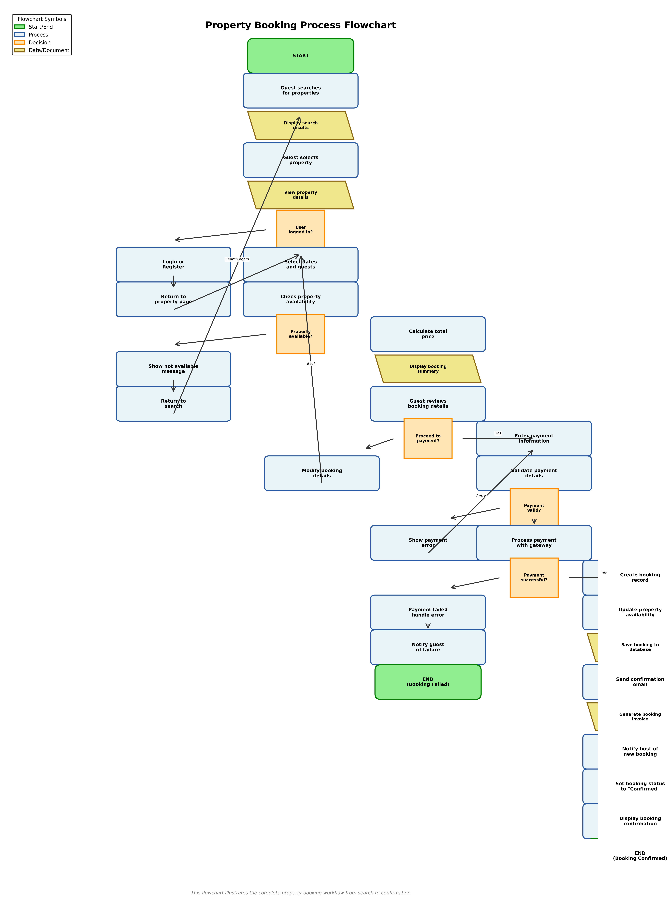

# Flowcharts - System Processes

This directory contains flowcharts that visualize the workflows and processes for key backend features of the Airbnb Clone system.

## Property Booking Process Flowchart

## Overview

This flowchart illustrates the complete **Property Booking Process** workflow, from initial search to booking confirmation. It shows all decision points, process steps, and data flow for this critical backend feature.

## Process Steps

### 1. Property Search & Selection
- Guest searches for properties
- Display search results
- Guest selects a property
- View property details

### 2. Authentication Check
- Check if user is logged in
- If not logged in: Login or Register
- Return to property page after authentication

### 3. Booking Configuration
- Select check-in and check-out dates
- Select number of guests
- Check property availability
- If not available: Show message and return to search
- If available: Calculate total price

### 4. Booking Review
- Display booking summary
- Guest reviews booking details
- Decision: Proceed to payment or modify details

### 5. Payment Processing
- Enter payment information
- Validate payment details
- If invalid: Show error and retry
- If valid: Process payment with payment gateway
- Check payment success

### 6. Booking Confirmation (Success Path)
- Create booking record
- Update property availability calendar
- Save booking to database
- Send confirmation email to guest
- Generate booking invoice
- Notify host of new booking
- Set booking status to "Confirmed"
- Display booking confirmation to guest
- End: Booking Confirmed

### 7. Error Handling (Failure Path)
- If payment fails: Handle error
- Notify guest of failure
- End: Booking Failed

## Flowchart Symbols

- **Start/End (Green rounded rectangles)**: Beginning and end points of the process
- **Process (Light blue rectangles)**: Operations or actions performed
- **Decision (Orange diamonds)**: Decision points with yes/no or true/false paths
- **Data/Document (Yellow parallelograms)**: Data storage or document creation steps
- **Arrows**: Flow direction and process sequence

## Key Decision Points

1. **User logged in?** - Determines if authentication is required
2. **Property available?** - Checks if selected dates are available
3. **Proceed to payment?** - Guest decides to continue or modify booking
4. **Payment valid?** - Validates payment information
5. **Payment successful?** - Confirms payment gateway transaction

## Process Highlights

- **Error Handling**: Multiple error paths for payment failures and validation errors
- **Loop Backs**: Ability to modify booking details and retry payment
- **Parallel Actions**: After successful payment, multiple actions occur (database save, email, notifications)
- **State Management**: Booking status updates throughout the process

## Use Cases Covered

This flowchart addresses the following user stories:
- US-G005: Search Listings
- US-G006: View Listing Details
- US-G007: Book Property
- US-G010: Make Payment
- US-G008: Manage Booking
- US-H004: Manage Booking Requests

## Source

Generated programmatically using Python/Matplotlib: `generate_flowchart.py`

## Related Documentation

- Features & Functionalities: `../features-and-functionalities/`
- Use Case Diagram: `../use-case-diagram/`
- User Stories: `../user-stories/`
- Data Flow Diagram: `../data-flow-diagram/`

---

**Last Updated**: October 29, 2024
**Version**: 1.0
**Process Documented**: Property Booking Workflow

