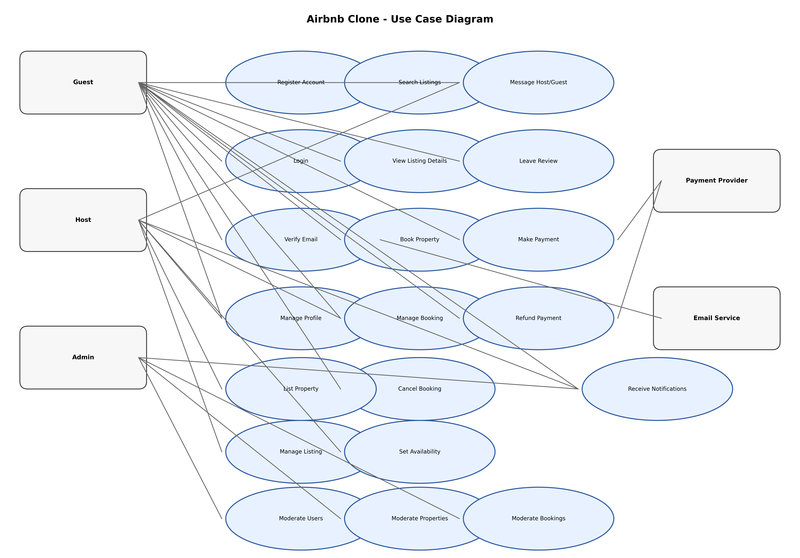

# Airbnb Clone Backend - Use Case Diagram

This directory contains the use case diagram for the Airbnb Clone backend, visualizing key interactions between actors and the system.

## Actors
- Guest
- Host
- Admin
- Payment Provider (external)
- Email Service (external)

## Key Use Cases
- Register, Login, Verify Email, Manage Profile
- Search Listings, View Listing Details
- List Property, Manage Listing, Set Availability
- Book Property, Manage Booking, Cancel Booking
- Make Payment, Receive Payout, Refund
- Message Host/Guest, Leave Review
- Admin Moderate Users/Properties/Bookings
- Receive Notifications

## Diagram

## Source
Generated programmatically using Python/Matplotlib: `use_case_diagram.py`.

